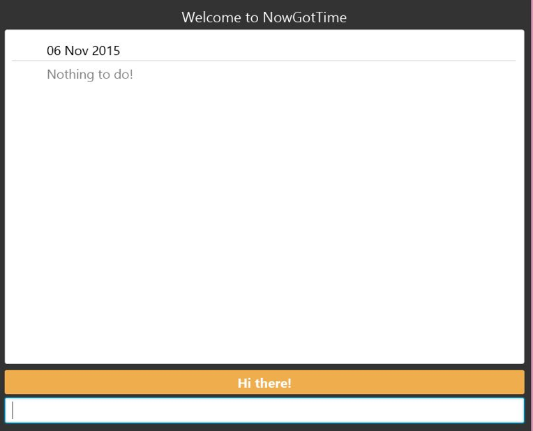

# NowGotTime

## About
NowGotTime is the perfect software for you to keep track of your deadlines from your heavy workload. It is designed by combining the advantages of both command line and graphical user interface.
Different from contemporary applications, NowGotTime gives you the ability to link events in your schedule, and to view them in a timeline. This can serve as a reminder of the progress of a project you are working on, as well as to assist you in the planning of an unfinished project.

## Installation
**Step 1:** Ensure that you have the basic software requirement of Java 8. If not, you may install Java 8 from here.

**Step 2:** Download the NowGotTime.jar from this [link](https://github.com/cs2103aug2015-t09-3j/main/releases).

**Step 3:** To launch the application, double click on the NowGotTime.jar file.

## Cheatsheet

### Basic commands
#### Adding
Command | Description 
--------| ----------- | -------
`add "<EVENT>" from <START> to <END>` | add an event with name `<EVENT>`, start date/time `<START>` and end date/time `<END>` | ✅
`add "<TODO>" by <DEADLINE>` | add a todo with name `<TODO>` and deadline date/time `<DEADLINE>` | ✅ | 
`add "<TODO>"` | add a floating todo with name `<TODO>` | ✅ | 
#### Deleting
Command | Description
--------| ----------- | -------
`delete <INDEX>` | delete an item with index | ✅ |
`delete "<KEYWORD>"` | delete an item with keyword `<KEYWORD>` | ✅ |
#### Editing
Command | Description 
--------| ----------- | -------
`edit <INDEX> name "<NAME>"` | edit name of an item with index `<INDEX>` | ✅ |
`edit <INDEX> start <START>` | edit start date/time/both of an item with index `<INDEX>` | ✅ |
`edit <INDEX> end <END>` | edit end date/time/both of an item with index `<INDEX>` | ✅ |
`edit <INDEX> due <DEADLINE>` | edit deadline date/time/both of an item with index `<INDEX>` | ✅ |
`edit "<KEYWORD>" name "<NAME>"` | edit name of an item with keyword `<KEYWORD>` | ✅ |
`edit "<KEYWORD>" start <START>` | edit start date/time/both of an item with keyword `<KEYWORD>` | ✅ |
`edit "<KEYWORD>" end <END>` | edit end date/time/both of an item with keyword `<KEYWORD>` | ✅ |
`edit "<KEYWORD>" due <DEADLINE>` | edit deadline date/time/both of an item with keyword `<KEYWORD>` | ✅ |
#### Checking and Unchecking
Command | Description 
--------| ----------- | -------
`check <INDEX>` | mark done item with index `<INDEX>` | ✅ |
`check "<KEYWORD>"` | mark done item with keyword `<KEYWORD>` | ✅ |
`uncheck <INDEX>` | mark undone item with index `<INDEX>` | ✅ |
`uncheck "<KEYWORD>"` | mark undone item with keyword `<KEYWORD>` | ✅ |

#### Viewing
Command | Description
--------| ----------- | -------
`search "<KEYWORD>"` | show items with keyword <KEYWORD> | ✅ |
`view` | show today events and todos | ✅ |
`view <DATE>` | show events and todos that occurs on `<DATE>` | ✅ |

#### Others
Command | Description 
--------| ----------- | -------
`undo` | undo last add, delete, or edit command | ✅ | 
`redo` | redo last undo command | ✅ | 
`set "<DIRECTORY>"` | change save directory to `<DIRECTORY>` | ✅ |
`exit` | exit NowGotTime | ✅ |

### Project Commands
#### Adding
Command | Description
--------| ----------- | -------
`add project "<PROJECT>"` | add a project with name `<PROJECT>` | ✅ |
`add "<EVENT>" to "<PROJECT>"` | add `<EVENT>` to `<PROJECT>` | ✅ |
`add progress <INDEX> "<PROGRESS>"` | add progress `<PROGRESS>` to event with index `<INDEX>` inside project | ✅ |

#### Deleting
Command | Description
--------| ----------- | -------
`delete project "<PROJECT>"` | delete a project with name `<PROJECT>` | ✅ |
`delete <INDEX> from project` | delete an event from project with name `<PROJECT>` | ✅ |
`delete progress <INDEX>` | delete progress from event with index `<INDEX>` inside project | ✅ |

#### Editing
Command | Description  
--------| ----------- | -------
`edit project "<PROJECT>" name "<NAME>"` | edit name of a project with name `<PROJECT>` to `<NAME>`| ✅ | 

#### Viewing
Command | Description
--------| ----------- | -------
`view "<PROJECT>"` | show events of `<PROJECT>` | ✅ |

 